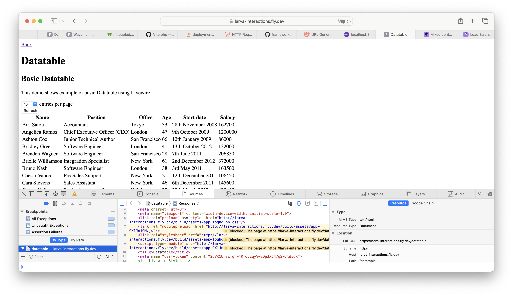
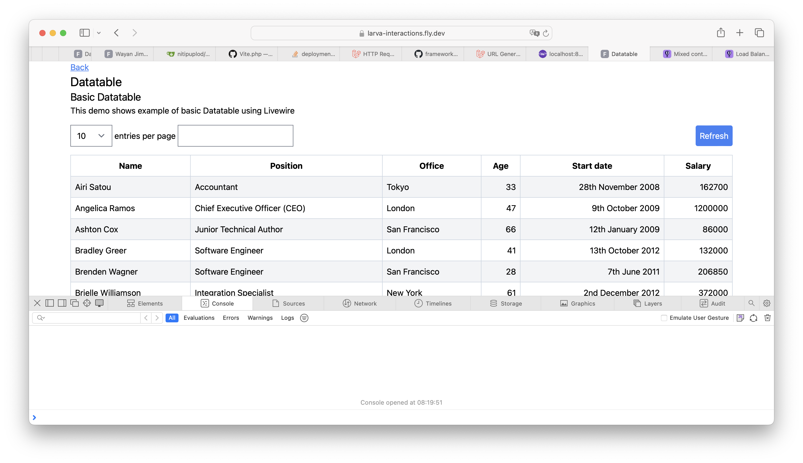

Several days ago, I try Fly.io, a cloud provider for many web stacks included Laravel. Actually, I know this cloud provider several years ago but I don't try it because I don't have any use case at that time. Now, I use it to ship my project, [Larva Interactions](https://github.com/senkustream/larva-interactions). To deploy this project into Fly.io, I need to create Fly.io account, add credit card or equivalent of that to proof that I'm human because Fly.io afraid of misuse their tool for mining or crypto, install flyctl (a Fly.io CLI), and create Docker image for my project. So far so good. But, I get a problem: I get a mixed content (Http and Https) inside my page (Datatable).



The page doesn't get CSS style because the CSS served in http protocol meanwhile, the site itself served in https protocol. I find [the similar issue in Fly.io forum](https://community.fly.io/t/mixed-content-https-http-errors-with-inertia-app/7888) and the solution is setup TrustedProxy to trust any proxy. Here's my setup in my project, I use Laravel version 11.

```php
// bootstrap/app.php

<?php

withMiddleware(function (Middleware $middleware) {
    // Enable Trust Proxies
    $middleware->append(TrustProxies::class);

    // Trusting all proxies because I use fly.io
    $middleware->trustProxies(headers: Request::HEADER_X_FORWARDED_FOR |
    Request::HEADER_X_FORWARDED_HOST |
    Request::HEADER_X_FORWARDED_PORT |
    Request::HEADER_X_FORWARDED_PROTO |
    Request::HEADER_X_FORWARDED_AWS_ELB, at: '*');
});
```

I deploy again and everything works properly.



In the forum, I see someone use `URL::forceScheme('https')` inside `AppServiceProvider`. But, I don't like the approach (I follow my intuition). The TrustedProxies makes sense for me. Here's the reason I got from Laravel Documentation.

> When running your applications behind a load balancer that terminates TLS / SSL certificates, you may notice your application sometimes does not generate HTTPS links when using the url helper. Typically this is because your application is being forwarded traffic from your load balancer on port 80 and does not know it should generate secure links.

> If you are using Amazon AWS or another "cloud" load balancer provider, you may not know the IP addresses of your actual balancers. In this case, you may use * to trust all proxies.

That's it! I hope it helps your problem.