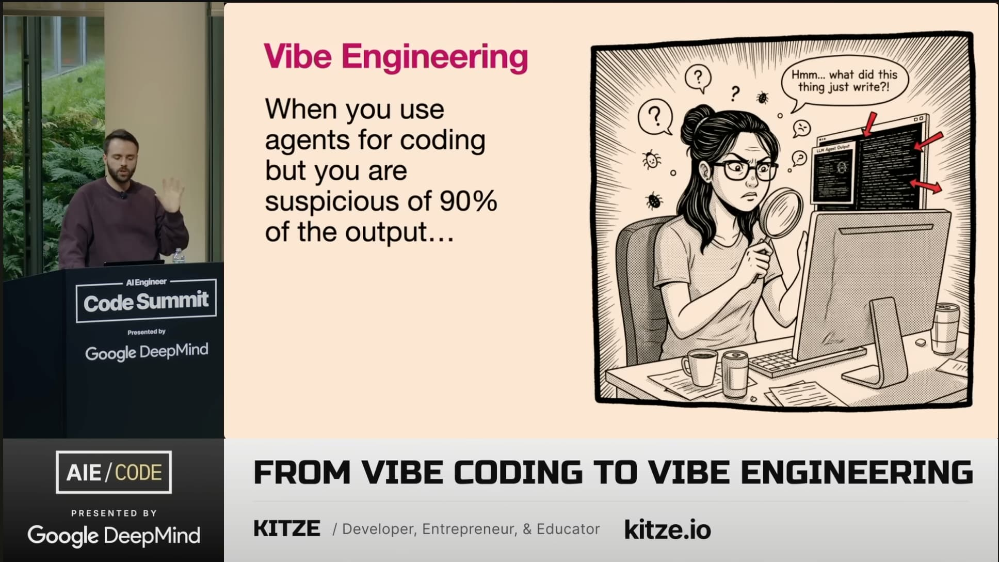

I watched [the Kitze's (creator of Sizzy) talk: **From Vibe Coding to Vibe Engineering**](https://www.youtube.com/watch?v=JV-wY5pxXLo) couple days ago. The term of Vibe Coding has been spread years ago. But, I feel this term is not suitable for me who has been involved in programming world since 2013. Then, Kitze propose the new term called **Vibe Engineering**: "When you use agents for coding but you are suspicious of 90% of the output." 

> Hmm, actually, I'm more like the term to be renamed to be "Vibe Programming". Because we give as programmer still gives instruction to computer but in 3.0 way a.k.a. prompting in human language.

I'm really like this term! Why? Because no matter how "the smart" the AI is, it's still just an artificial intelligence. We as the human should be verify the output. We should not be lazy to verify the output otherwise the quality of software will be dropped (again). If you want to give me any proofs related on quality of software this day then read [**Stupid Slow: The Perceived Speed of Computers**](https://www.datagubbe.se/stupidslow/) later on after this post is finished.

Now, in 2026, Claude Code with Opus model get a lot of kudos from many programmers around the world. Most of them say that the precision near to 90% of output. I don't know whether their (human) prompt is better, the programming language or framework DX is better that AI can generate better output, or anyelse factors. But, again, no matter how "the smart" AI is, it's still just an artificial intelligence. We as the human should be verify the output. Even one day Claude Code or any model of LLM can make a fixed of FFmpeg, Zig programming language, Linux Kernel, it's still our job as a professional programmer or human to verify the output. We must be suspicious with AI output in 90% cases.

Aside of that, today in my Twitter timeline, I saw [Simon's tweet](https://xcancel.com/simonswiss/status/2008519159211311430) that he got laid off from Laracasts as teacher course. I read his tweet and my opinion is because of AI's effect indirectly. [Somebody blames Jeffrey Way's decision](https://xcancel.com/benjamincrozat/status/2008587477809066470?s=20). I don't think Jeff's decision wrong. He's running business and I'm bit sad when the [Laracasts's revenue was drop](https://xcancel.com/jeffrey_way/status/2007812054355169556?s=20) in end of the year. My wish is Simon can gets the new job or new way to generate main income again. Also, Jeffrey can have the way to generate stable income again in his business, Laracasts.

I cannot deny that one day I can be get laid off one day either because the company want to shrink the employee(s) in order to make business still run or any factors. Then, I wonder what should I do? Should I try farming like Thanos did or learn from [Rio](https://www.yhotie.com) to be a farmer of Blockchain? I don't know what's the futures lies on me. But, the thing that I know is the future create based on my action in this present moment.
