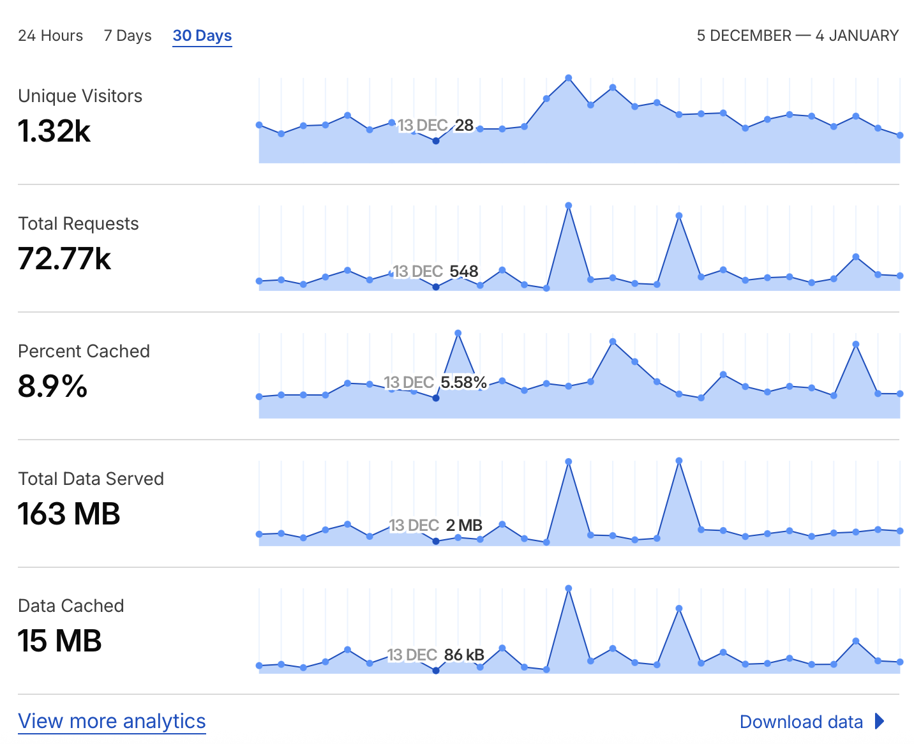
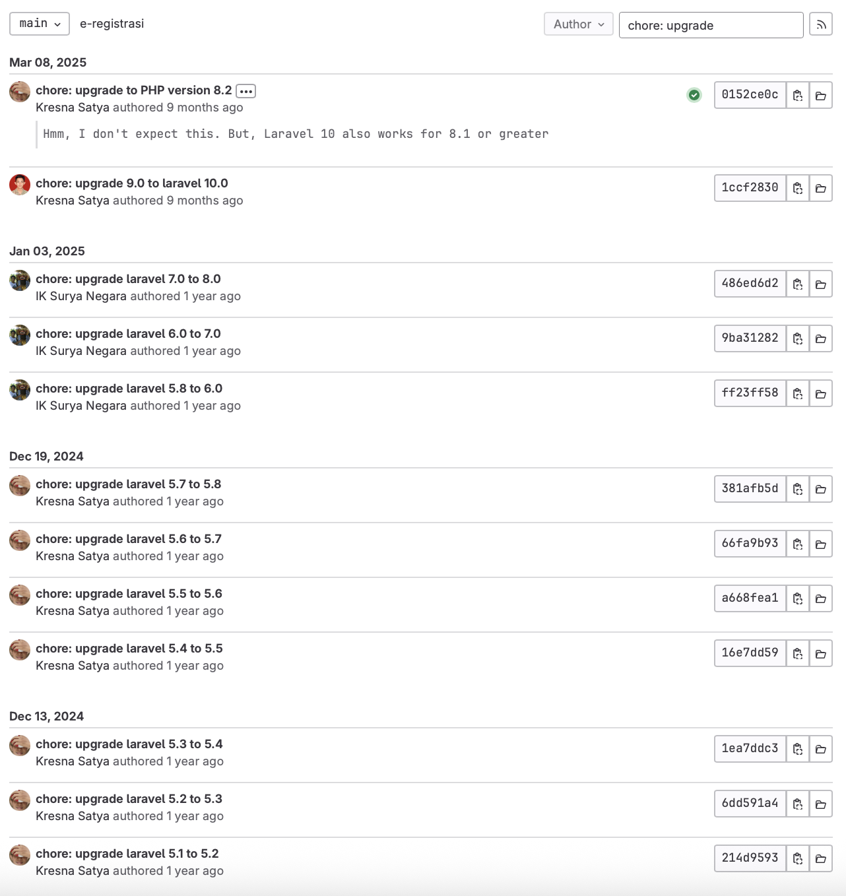
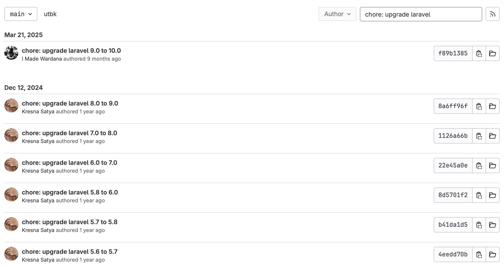

> Actually, I would like to create and publish this post in December 2025. But, many things happen in my real life and I keep procrastinate myself to create this post. Well, this is the result. I can deliver it on 2026.

I started make the Laravel Diff, a utility to compare what files changed when upgrade the Laravel project in September 2024. You can see the first commit by visit the [Laravel Diff's commits](https://github.com/senkulabs/laraveldiff.org/commits/main/?after=dfe5987fb7451fdc0985a32c9af54be962969fac+34). It builds on top SvelteKit and deployed on Cloudflare. I decided to buy domain [laraveldiff.org](https://laraveldiff.org) in the same month and until this post published it has 1.32k unique visitors in 30 days based on Cloudflare analytics.

The idea comes from the [railsdiff.org](https://railsdiff.org). I make version for Laravel with SvelteKit, the framework from the Svelte (the JS compiler library that I really like and love till this day). If you check [Laravel's upgrade documentation in Miscellaneous section](https://laravel.com/docs/12.x/upgrade#miscellaneous), you need to check view changes when upgrade Laravel project by using comparison tool that build by GitHub. I see a chance that it can be improved by looking design in RailsDiff. That's the origin of Laravel Diff.

Around November to December 2024, my coworkers in Udayana University received "ancient Laravel projects" from senior coworker. The "ancient Laravel projects" are two admission web apps that uses Laravel version 5.1 and 5.6. The development and deployment workflows are terrible (honestly). It was handle by one-man-show and sometimes get help from other coworkers. The file storage merged into the web app itself, they develop and deploy the code live in production (scary emoji inserted) via FTP and this makes Git workflow useless and there's no source of truth. It's so sad for the web apps in admission system which is the core value of university to generate income. One thing that I'm really appreciate so far is this app still can be handled and running since 2017.

Another side effect is security-side. In 2024, Laravel has reach version 11 with minimum PHP version 8.2. Meanwhile those apps, still running Laravel version 5.1 and 5.6 which required PHP version 5.6+ and 7.0+. In 2024, those PHP versions are not supported and security breach can be happened anytime. This makes worse when you [merge file storage into the web app itself](https://x.com/taylorotwell/status/1153326292412129280) and your deployment is not follow the Laravel rule.

> Do you still remember deploy Laravel in `protected` folder? If so, you're an old generation in Laravel. This happened in those "ancient Laravel projects" that we take care at that time.

I was still working for Udayana University at that time. We have more than 30 web apps that use the old Laravel version and also use CodeIgniter version 3.x. The deployment also doesn't follow the conventions especially for the Laravel. Around 2 to 5 web apps that uses the new Laravel version and those follow the Laravel deployment rule. We only have 12 programmers (included myself). Each of us has our responsibility to handle web apps. Even one of us is taking care hundreds of websites that using WordPress, Laravel, and CakePHP. That's crazy!

With the situation my coworkers got the "ancient Laravel projects" to take care and I have created the Laravel Diff to inspect file changes in upgrade Laravel project, I see a chance to use this tool. I persuade them to upgrade the Laravel version of those projects incrementally. I voluntarily myself to involve in this project in order to test the functionallity Laravel Diff. It's not good at first, because there's no strict checker in Laravel Diff when we want to upgrade from X version (source) to Y version (target). For example, when we want to upgrade Laravel version 5.1, we don't allowed to upgrade it directly to the latest version (version 11). We must upgrade it incrementally, from Laravel 5.1 to 5.2. Also, there's specific case where there's no Laravel version 5.9. So, the latest version in 5.x is 5.8. Then, the upgrade must be from 5.8 to 6.x. Another challenge was the third-party packages in those admission systems. It uses [ixudra/curl](https://github.com/ixudra/curl) for HTTP request, the [laravel-fpdf wrapper](https://github.com/ristekusdi/laravel-fpdf) for print PDF (you create PDF with coordinate NOT HTML which is really really horrible), and [laravelcollective/html](https://laravelcollective.com/docs) for blade utility (it's support until Laravel version 10). 

It's really hard when upgrade the web apps that have a lot of codes and a lot of routes. So, I make a simple rules: 

1. If the main page or main root works well after upgrade to newer version then continue.
2. If the third-party packages get in a way when upgrade project to the newer version then remove it.

The result, we successfully upgrade the Laravel version of admission systems into version 10. Although, we must keep the Laravel Collective, because one of admission systems use it a lot. This task is like a winter project. It takes 2 to 3 days of works to make upgrade succesful. It takes 1 to 2 weeks to make the functionality of web app running well.

The question is: Is supervisor approved it? Honestly not (at first time). Even my supervisor was surprised that we can upgrade those "ancient projects" into Laravel version 10. He even ask my coworker whether this upgraded version was already in production. My supervisor was have a plan to re-write the app from the scratch using the newest Laravel in a month (at least MVP). But, I'm worry about that plan. First, our resources are limited, we only 12 programmers. Each of us is busy with the apps that we responsible to. Second, our deadline is limited because of our customers's (damn and weird) requests. The realistic solution is incremental upgrade the project. Fortunately in March 2025, my supervisor use our works. So, our works are pay off. 

Here are the benefits we get from incremental upgrade Laravel project:

1. We can run the project in local development.
2. We can use modern third-party library or built-in library from Laravel like [HTTP Client](https://laravel.com/docs/12.x/http-client).
3. The project can collaborate with many programmers (previously it was take care by one-man-show).
4. We can read and maintain code base. Even our deployment already follow the Laravel rules and we use Continuous Deployment.
5. We much more confident to deliver features and fix bug because we use Git workflow and we get the "source-truth".

I don't know what is happening now in those admission systems because I no longer work there. I think that those admission systems can be merged into one admission system. If they want, they can keep going to incremental upgrade the project into the latest Laravel version by replace the Laravel Collective's Blade into the Laravel Blade. But, if they want to re-write from scratch now, it's okay too as long as they have their time.

This is a story of journey of incremental upgrade your Laravel project. I hope with our story, you started upgrade your Laravel version in your project in order to save your sanity in the future. My tip is always make your project less or even zero dependency with any third-party a.k.a. [keep vanilla](https://dev.37signals.com/a-vanilla-rails-stack-is-plenty/). Because who knows those third-parties will be unmaintained and one day you will get trouble with it. Unless the third-party is credible like [Spatie](https://spatie.be). :)

