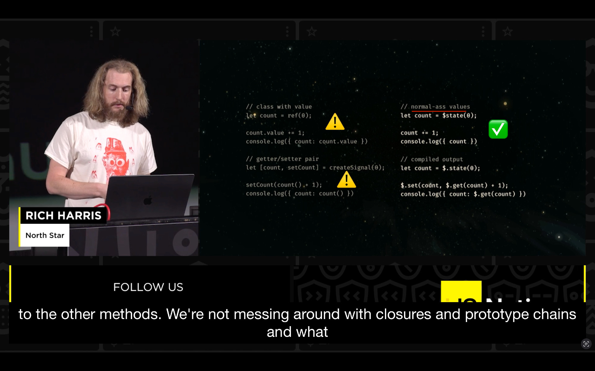

Tulisan ini berisi tentang kapan saya mengenal React dan Svelte, vibes/atmosfer antara React dan Svelte, dan alasan saya memilih Svelte dibanding React.

## Kelahiran React

Saya mengenal React ketika berada di semester akhir di perguruan tinggi antara tahun 2015 dan 2016. Saya melihat postingan komunitas di Indonesia yang ditulis oleh Riza Fahmi yang bekerja di Hacktiv8 dan Sonny Lazuardi yang bekerja di Sales Stock waktu itu.

Jika saya tidak salah membaca tulisannya, Riza berpendapat bahwa React adalah versi masa depan dari JQuery dan ia memberikan beberapa contoh penggunaan React. Lalu, Sonny memberikan demo penggunaan React Native, sebuah jalan untuk mengembangkan aplikasi mobile menggunakan React dan Sales Stock adalah hasil dari React Native.

Di saat itu, ketika kamu membuat sebuah komponen di React, kamu perlu menulisnya menggunakan pendekatan class daripada functional.

::: code-group labels=[react_2015.js, react_2016.js]

```js
const Button = React.createClass({
    state: {
        count: 1
    },
});

handleClick(event) {
    console.log('clicked');
    this.setState({ count: this.state.count + 1 });
},

render() {
    return (
        <button onClick={this.handleClick}>
            {this.props.children}
        </button>
    )
}
```

```js
class Button extends React.component {
    state = {
        count: 1
    };

    handleClick = () => {
        console.log('clicked');
        this.setState({ count: this.state.count + 1 });
    };
}
```

:::

Satu tahun lalu, saya membeli sebuah kursus daring interaktif yang sangat menarik yaitu [Joy of React](https://www.joyofreact.com). Kursus ini dibuat oleh Josh Comeau yang pernah bekerja di Khan Academy dan Digital Ocean.
Ia adalah seorang yang memiliki kemampuan mengajar yang hebat dan saya pun memutuskan untuk membeli kursusnya. Alasan lainnya adalah React masih memiliki permintaan yang cukup tinggi di dunia kerja sampai hari ini...

> Ya, sampai hari ini. 

Untungnya, kursus ini memiliki purchased parity program sehingga saya bisa membeli kursus ini dengan biaya yang masih bisa dijangkau.

Pada bagian pertama di kursus ini, Josh menceritakan alasan React tercipta. Ini adalah kutipannya.

> In the early 2010s, Facebook developers had a problem. Thousands of people were complaining about "phantom messages".

> Users would see a little 1 notification badge by the "messages" icon, suggesting they had new messages. But when they'd click it, there wouldn't be anything new, just the same old messages.

> At the time, the UI had 3 separate locations where message state was presented: Message Drawer, Chat Widget, and Main View.


> Users were getting phantom messages because these 3 parts of the UI were powered by separate views, and those views were getting out of sync.

> This might seem like a trivial problem to solve, but Facebook is a tremendously complex app, with hundreds of developers across dozens of teams all collaborating, adding new features, moving fast and breaking things. Every week, some new edge-case would crop up, leading to phantom messages. It was like playing whack-a-mole; every time they fixed a bug, a new one would pop up.

> The team eventually solved this problem by migrating to an experimental new internal tool: React. This problem, along with so many others, disappeared.

Silakan simak [**Rethinking Web App Development at Facebook** yang dipresentasikan oleh Jing Cheng](https://www.youtube.com/watch?v=nYkdrAPrdcw&t=624s).

Beberapa bulan sebelum saya membeli kursus Joy of React, saya melihat sebuah tweet dari ex Meta engineer.
Isi dari tweet ini adalah permasalahan dari Facebook Chat dan cukup berkaitan dengan kutipan sebelumnya. Berikut kutipannya.

> I worked on Facebook Chat for several years, both on the front end and the infrastructure.

> Before the major effort to redo the UI, FB Chat was super broken and we had no idea why.

> We got tons of bug reports about Chat being broken every day, but we noticed an odd pattern in the data: the volume of reports didn't match the volume of usage. It was time-shifted from the peaks we'd see in the US.

> We didn't know what was wrong, but we knew the code was a mess.

> We set about rewriting both the front-end and the back-end in an effort to fix it.

> The front-end rewrite pulled in a whole team of amazing engineers and became one of the big threads that led to 
ReactJS

> In the public eye, we portrayed this project as the one that ultimately fixed Chat.

> And the way I've usually told it, fixing Facebook Chat and the birth of React are the same story.

> But no framework was going to fix the worst problem with Chat.

> During the time we were working on the Chat rewrite, we were also replacing the original Erlang backend with one written in C++.

> This was probably a good move, but the problem wasn't with Erlang either.

> Our initial spec for the new backend didn't say much about observability, but it was an important feature, and the rewrite forced us to rebuild it.

> Little did we know this would lead us to the root cause of our problems…

> When we finally gained insight into our deliverability data, we were able to cut it by region.

> We noticed Chat was really popular in India. This was before WhatsApp, at a time when SMS wasn't reliable.

> Eventually we pinpointed a region in India where one specific DNS provider was giving out the wrong IP addresses for our Chat servers.

> So when people went to use Chat, they would sometimes get a notification that they had a message, and then it would disappear.

> Or they'd send a message and it would get lost. All because they were connecting to the wrong IP address.

> That was it!

> None of the sexy new tech we were working on was going to solve that problem.

> Ever.

> Instead, **the solution was to build observability that allowed us to track end-to-end message delivery.**

Untuk tweet lengkapnya, silakan lihat [Adam Wolff's tweet](https://x.com/dmwlff/status/1762885255030259854).

Setelah saya membaca tweet ini, saya bergumam:

> Jika Facebook menyelesaikan masalah DNS lebih awal, saya berpikir bahwa ReactJS tidak perlu ada dan JQuery masih menjadi raja!

> Atau mungkin ReactJS masih tetap ada namun dengan kurva pembelajaran yang lebih sederhana.

Saya hanya bergumam dan saya mungkin bisa salah. Namun, hal yang saya pelajari adalah **build observability is the key to to track end-to-end message delivery in Facebook Chat.**

Kemudian, saya berpikir [kita semua harus menghormati React](/posts/give-a-space-for-reactjs). Berkatnya, banyak framework lahir dengan ide-ide yang lebih baik seperti Svelte dengan pendekatan compiler dan SolidJS dengan pendekatan signal.

## Kelahiran Svelte

Pertama kali saya mengenal Svelte adalah ketika saya menonton presentasi Rich Harris tahun 2019. Ia mempresentasikan materi berjudul **Rethinking Reactivity** dan Svelte 3 adalah hasil dari **Rethinking Reactivity**.
Sampai hari ini, saya selalu kagum dengan caranya berbicara untuk mempromosikan ide-idenya. Satu hal yang saya sangat suka dari Svelte adalah ketika kamu mengubah sebuah nilai maka gunakan operator alih-alih function atau dot notation of object.




Pertanyaannya adalah bagaimana Svelte bisa mencapai hal-hal di atas sedangkan framework lain tidak?

Sebenarnya, [Svelte adalah sebuah bahasa pemrograman](https://gist.github.com/Rich-Harris/0f910048478c2a6505d1c32185b61934) yang mana akan dikompilasi menjadi sebuah JavaScript yang dioptimasi secara ketat.

Ini adalah hasil ketika kita mendeklarasi dan melakukan perubahan nilai menggunakan cara Svelte.

::: code-group labels=[Svelte, Compiled Svelte]

```html
<script>
    // Normal-ass values
    let count = $state(0);
    count += 1;
    console.log({ count });
</script>
```

```js
// Compile output
let count = $.state(0);

$.set(count, $.get(count) + 1);
console.log({ count: $.get(count) });
```

:::

Sintaks di atas adalah Svelte versi 5 yang mana versi teranyar setelah versi 3 dan 4. Di Svelte 3 dan 4, ada beberapa sintaks yang saya tidak suka dan untungnya telah diubah di Svelte 5.

- `$:` untuk derived/effect. Di Svelte 5 diubah menjadi `$derived` and `$effect`.
- `export let` untuk mengoper properti ke sebuah komponen. passing properties into component. Di Svelte 5 diubah menjadi `$props`.
- Event listener seperti `on:click` changed into `onclick` in Svelte 5 yang mana merupakan hal yang natural di atribut HTML.

Jika kamu pernah mencoba React sebelumnya dan mencoba Svelte 5 maka kamu akan merasakan bahwa betapa mudahnya membuat sebuah komponen atau web app dengan fundamental HTML, CSS, dan JavaScript. That's it!

Lantas, mengapa Rich Harris membuat Svelte seperti ini? Karena ia bekerja sebagai visual journalism programmer.

Di dunia jurnalis, kamu memiliki tenggat waktu yang ketat, kamu diharapkan [membuat sebuah aplikasi interaktif sesegera mungkin](https://www.youtube.com/watch?v=uMyvt9KfpFk).
Berkat Svelte, kamu hanya membutuhkan alat-alat yang dibutuhkan sebagai web programmer yaitu HTML, CSS, dan JavaScript.

## Vibes

Mari kita bicara tentang vibes/aura/atmosfer/kesan. Vibes di sini artinya apa yang saya rasakan ketika melakukan pemrograman web menggunakan React dan Svelte.

Pertama, mari kita lihat [definisi dari Vibes berdasarkan Merriam-Webster](https://www.merriam-webster.com/dictionary/vibe).

> *"A distinctive feeling or quality capable of being sensed"*

> "Perasaan atau kualitas khas yang dapat dirasakan"

E.g.

This place has a good/bad vibe.

She gave me a weird vibe. = She gave off a weird vibe. = I got a weird vibe from her.

### State + Create a Component

Saya ingin mengumpamakan `state` adalah suatu hal yang dapat berubah tergantung aksi pengguna. Lalu, saya juga ingin mengumpamakan bahwa `state` adalah sebuah Model, yang mana merupakan bagian dari MVC atau MVVM. Mari kita lihat contoh mendeklarasikan state di React dan Svelte dengan contoh project bernama [Floating](https://github.com/senkulabs/floating-coin-react) [Coin](https://github.com/senkulabs/floating-coin-svelte).

::: code-group labels=[React, Svelte]

```js
import { useState } from 'react'
import './Coin.css'

function App() {
  const [numOfCoins, setNumOfCoins] = useState(0)

  return (
    <div className="wrapper">
      <main>
        <div className="coin-wrapper">
          <button className="coin" onClick={() => setNumOfCoins(numOfCoins + 2)}>
            <span className="visually-hidden">Add 2 coin</span>
            
          </button>
        </div>
      </main>
      <footer>
        Your coin balance:
        <strong>{numOfCoins}</strong>
      </footer>
    </div>
  )
}

export default App
```

```html
<script>
  import './Coin.css';

  let numOfCoins = $state(0);
</script>

<div class="wrapper">
  <main>
    <div class="coin-wrapper">
      <button class="coin" onclick={() => numOfCoins += 2}>
        <span class="visually-hidden">Add 2 coin</span>
        
      </button>
    </div>
  </main>
  <footer>
    Your coin balance:
    <strong>{numOfCoins}</strong>
  </footer>
</div>
```

:::

1. Untuk membuat sebuah state di React, kita menggunakan fungsi bernama `useState()` yang kita impor dari `react`. Untuk membuat state di Svelte, kita menggunakan sebuah *rune* atau simbol bernama `$state()`. Kamu tidak perlu mengimpor apapun di `$state` karena itu adalah bagian dari bahasa pemrograman Svelte. _Rune is a letter or mark used as a mystical or magic symbol_.

2. Ketika kamu mengklik koin, nilai berubah dari 0 menjadi 2. Di React, untuk mengubah value tersebut, kamu perlu memanggil fungsi `setNumOfCoins` seperti `setNumCoins(numOfCoins + 2)`. Di  Svelte, untuk mengubah value maka kamu hanya membutuhkan operator seperti `numOfCoins += 2` atau `numOfCoins = numOfCoins + 2`. 

3. Untuk membuat komponen di React hari ini, kamu menggunakan pendekatan fungsional dibantu dengan JSX. JSX seperti HTML di JavaScript. Sehingga, atribut seperti `class` dan `onclick` berubah menjadi `className` and `onClick`. Berdasarkan pengamatan saya, kita tidak dapat menulis `class` di JSX karena akan terjadi konflik dengan keyword `class` dari JavaScript.

4. Untuk membuat komponen di Svelte, [gunakan HTML, bahasa ibu dari web](https://www.youtube.com/watch?v=BzX4aTRPzno&t=12m16s). Atribut seperti `class` dan `onclick` di Svelte sama seperti HTML. Berterima kasihlah kepada compiler.

### Separate Component + Principle of Least Privilege

Mari kita melakukan refactor dengan membuat sebuah komponen `Coin` dan kita panggil di komponen `App`.

Pertama, mari kita lihat di bagian React.

::: code-group labels=[App.jsx, Coin.jsx]

```js
import { useState } from 'react'
import Coin from './Coin'

function App() {
  const [numOfCoins, setNumOfCoins] = useState(0)

  function handleNumOfCoins () {
    setNumOfCoins(numOfCoins + 2); 
  }

  return (
    <div className="wrapper">
      <main>
        <Coin handleNumOfCoins={handleNumOfCoins} />
      </main>
      <footer>
        Your coin balance:
        <strong>{numOfCoins}</strong>
      </footer>
    </div>
  )
}

export default App
```

```js
import styles from './Coin.module.css';

function Coin({ handleNumOfCoins }) {
    return (
        <div className={styles.coinWrapper}>
          <button className="coin" onClick={handleNumOfCoins}>
            <span className="visually-hidden">Add 2 coin</span>
            
          </button>
        </div>
    )
}

export default Coin;
```

:::

Berikutnya, mari kita lihat bagian Svelte.

::: code-group labels=[App.svelte, Coin.svelte]

```html
<script>
  import Coin from './Coin.svelte';

  let numOfCoins = $state(0);

  function handleNumOfCoins() {
    numOfCoins += 2;
  }
</script>

<div class="wrapper">
  <main>
    <Coin handleNumOfCoins={handleNumOfCoins} />
  </main>
  <footer>
    Your coin balance:
    <strong>{numOfCoins}</strong>
  </footer>
</div>
```

```html
<script>
    let { handleNumOfCoins } = $props();
</script>

<div class="coin-wrapper">
    <button class="coin" onclick={handleNumOfCoins}>
        <span class="visually-hidden">Add 2 coin</span>
        
    </button>
</div>

<style>
/* Insert style here */
</style>
```

:::

React dan Svelte memiliki kemiripan untuk memecah komponen tetapi memiliki vibes yang berbeda dari segi sintaks. Di React, untuk menerima props atau properties di `Coin.jsx`, fungsi `Coin` harus menerima parameter object `{}`. Di Svelte, untuk menerima props atau properties di `Coin.svelte`, gunakan `$props` rune.

Di React, untuk menyimpan dan memanggil style CSS, kamu harus memberi nama `_your_component.module.css` and impor dengan perintah `import styles from './your_component.module.css'` di komponen kamu. Lalu, panggil class CSS dengan sintaks `{styles.cssClassName}`. Ini disengaja dengan tujuan untuk mencegah konflik style antar komponen jika terdapat nama style CSS yang sama. Di Svelte, kamu hanya perlu memasukkan CSS style ke dalam komponen dengan `<style>` tag.

Jika kita melihat kode di atas, kita tidak mengoper `numOfCoins` state ke komponen `Coin`. Sebagai gantinya, kita mengoper sebuah fungsi untuk memperbaharui `numOfCoins` yaitu `handleNumOfCoins`. Tujuannya adalah kita ingin mengimplementasikan **Principle of Least Privilege**. Di `Coin` component, hal yang dilakukan hanyalah mengklik koin dan melakukan fungsi `handleNumOfCoins`. Lalu, nilai dari `numOfCoins` berubah di `App` component. Mari umpamakan **Principle of Least Privilege** sebagai sebuah istilah untuk memberikan kekuatan yang secukupnya ke sebuah komponen. Kamu mungkin pernah mendengar istilah _Power tends to corrupt and absolute power corrupt absolutely_.

### Derived

Mari kita kunjungi Floating Coin. Kita menambah fungsionalitas utnuk membeli sebuah cokelat dengan harga 9 koin. Tetapi, ada sebuah masalah: Floating text muncul ketika kita menekan tombol "Buy chocolate".

Contoh di [React - Floating Coin - Buy Chocolate](https://component-issue.floating-coin-react.pages.dev/) dan [Svelte - Floating Coin - Buy Chocolate](https://component-issue.floating-coin-svelte.pages.dev/).

Di bawah ini adalah kepingan kode program dari React dan Svelte.

::: code-group labels=[React, Svelte]

```js
import { useState } from 'react'
import Coin from './Coin'
import styles from './App.module.css'
import FloatingText from './FloatingText'

const CHOCOLATE_COST = 9 

function App() {
  const [numOfCoins, setNumOfCoins] = useState(0)
  const [numOfChocolates, setNumOfChocolates] = useState(0)

  function buyChocolate() {
    setNumOfCoins(numOfCoins - CHOCOLATE_COST);
    setNumOfChocolates(numOfChocolates + 1);
  }

  function handleNumOfCoins () {
    setNumOfCoins(numOfCoins + 2); 
  }

  return (
    <div className={styles.wrapper}>
      <main>
        <Coin handleNumOfCoins={handleNumOfCoins} />
        { numOfCoins > 0 && <div className={styles.floatingNumWrapper}>
          <FloatingText key={numOfCoins}>
            +2
          </FloatingText>
        </div> }
        <button disabled={numOfCoins < CHOCOLATE_COST} className={styles.shopItem}
        onClick={buyChocolate}>
          Buy chocolate {numOfChocolates > 0 && (`(${numOfChocolates})`)}
        </button>
      </main>
      <footer>
        Your coin balance:
        <strong>{numOfCoins}</strong>
      </footer>
    </div>
  )
}

export default App
```

```html
<script>
  import Coin from './Coin.svelte';
  import FloatingText from './FloatingText.svelte';

  const CHOCOLATE_COST = 9;

  let numOfCoins = $state(0);
  let numOfChocolates = $state(0);

  function buyChocolate() {
    numOfCoins = numOfCoins - CHOCOLATE_COST;
    numOfChocolates = numOfChocolates + 1;
  }

  function handleNumOfCoins() {
    numOfCoins += 2;
  }
</script>

<div class="wrapper">
  <main>
    <Coin handleNumOfCoins={handleNumOfCoins} />
    {#if numOfCoins > 0}
    <div class="floatingNumWrapper">
      {#key numOfCoins}
      <FloatingText>
        +2
      </FloatingText>
      {/key}
    </div>
    {/if}
    <button disabled={numOfCoins < CHOCOLATE_COST} class="shop-item" onclick={buyChocolate}>
      Buy chocolate {numOfChocolates > 0 ? (`(${numOfChocolates})`) : ''}
    </button>
  </main>
  <footer>
    Your coin balance:
    <strong>{numOfCoins}</strong>
  </footer>
</div>
```

:::

Kriteria yang diharapkan adalah:

- Membeli sebuah cokelat tidak memicu animasi "+2"
  - Cokelat seharga 9 koin, untuk mengujinya, kamu perlu menekan koin sebanyak 5 kali, dan klik "Buy chocolate"
- Menekan koin tetap memicu animasi "+2"
- Animasi "+2" tidak boleh muncul ketika halaman pertama kali dimuat

Mari kita ambil momen hening sejenak. Apa saja solusi untuk menyelesaikan masalah ini?

> Sebuah petunjuk: Ada dua solusi yang bisa digunakan untuk menyelesaikan masalah ini. Apa itu?

<p style="margin-bottom: 16rem; font-size: 1.5rem;"><strong>3</strong></p>
<p style="margin-bottom: 16rem; font-size: 1.5rem;"><strong>2</strong></p>
<p style="margin-bottom: 16rem; font-size: 1.5rem;"><strong>1</strong></p>

Ok! Ada dua solusi yaitu membuat `state` baru atau membuat `derived state`. Kamu tidak perlu menggunakan `useEffect` atau `$effect`. 😉

1. Buatlah sebuah state bernama `floatingTextKey`. State ini akan menangani `FloatingText`.

::: code-group labels=[React, Svelte]

```js
import { useState } from 'react'
import Coin from './Coin'
import styles from './App.module.css'
import FloatingText from './FloatingText'

const CHOCOLATE_COST = 9 

function App() {
  const [numOfCoins, setNumOfCoins] = useState(0)
  const [numOfChocolates, setNumOfChocolates] = useState(0)
  const [floatingTextKey, setFloatingTextKey] = useState('initial');

  function buyChocolate() {
    setNumOfCoins(numOfCoins - CHOCOLATE_COST);
    setNumOfChocolates(numOfChocolates + 1);
  }

  function handleNumOfCoins () {
    setNumOfCoins(numOfCoins + 2); 
    setFloatingTextKey(crypto.randomUUID());
  }

  return (
    <div className={styles.wrapper}>
      <main>
        <Coin handleNumOfCoins={handleNumOfCoins} />
        { floatingTextKey !== 'initial' && <div className={styles.floatingNumWrapper}>
          <FloatingText key={floatingTextKey}>
            +2
          </FloatingText>
        </div> }
        <button disabled={numOfCoins < CHOCOLATE_COST} className={styles.shopItem}
        onClick={buyChocolate}>
          Buy chocolate {numOfChocolates > 0 && (`(${numOfChocolates})`)}
        </button>
      </main>
      <footer>
        Your coin balance:
        <strong>{numOfCoins}</strong>
      </footer>
    </div>
  )
}

export default App
```

```html
<script>
  import Coin from './Coin.svelte';
  import FloatingText from './FloatingText.svelte';

  const CHOCOLATE_COST = 9;

  let numOfCoins = $state(0);
  let numOfChocolates = $state(0);
  let floatingTextKey = $state('initial');

  function buyChocolate() {
    numOfCoins = numOfCoins - CHOCOLATE_COST;
    numOfChocolates = numOfChocolates + 1;
  }

  function handleNumOfCoins() {
    numOfCoins += 2;
    floatingTextKey = crypto.randomUUID();
  }
</script>

<div class="wrapper">
  <main>
    <Coin handleNumOfCoins={handleNumOfCoins} />
    {#if floatingTextKey !== 'initial'}
    <div class="floatingNumWrapper">
      {#key floatingTextKey}
      <FloatingText>
        +2
      </FloatingText>
      {/key}
    </div>
    {/if}
    <button disabled={numOfCoins < CHOCOLATE_COST} class="shop-item" onclick={buyChocolate}>
      Buy chocolate {numOfChocolates > 0 ? (`(${numOfChocolates})`) : ''}
    </button>
  </main>
  <footer>
    Your coin balance:
    <strong>{numOfCoins}</strong>
  </footer>
</div>

<style>
/* Insert style here */
</style>
```

:::

2. Buatlah sebuah derived state bernama `totalCoinsWasted`. Ini adalah sebuah nilai turunan dari state `numOfCoins` dan `numOfChocolates`.

::: code-group labels=[React, Svelte]

```js
import { useState } from 'react'
import Coin from './Coin'
import styles from './App.module.css'
import FloatingText from './FloatingText'

const CHOCOLATE_COST = 9 

function App() {
  const [numOfCoins, setNumOfCoins] = useState(0)
  const [numOfChocolates, setNumOfChocolates] = useState(0)

  // Derived value
  // We calculate how much coin user has wasted by
  // adding the value of number of chocolates to their current coin balance:
  const totalCoinsWasted = numOfCoins + numOfChocolates * CHOCOLATE_COST;

  function buyChocolate() {
    setNumOfCoins(numOfCoins - CHOCOLATE_COST);
    setNumOfChocolates(numOfChocolates + 1);
  }

  function handleNumOfCoins () {
    setNumOfCoins(numOfCoins + 2); 
  }

  return (
    <div className={styles.wrapper}>
      <main>
        <Coin handleNumOfCoins={handleNumOfCoins} />
        { totalCoinsWasted > 0 && <div className={styles.floatingNumWrapper}>
          <FloatingText key={totalCoinsWasted}>
            +2
          </FloatingText>
        </div> }
        <button disabled={numOfCoins < CHOCOLATE_COST} className={styles.shopItem}
        onClick={buyChocolate}>
          Buy chocolate {numOfChocolates > 0 && (`(${numOfChocolates})`)}
        </button>
      </main>
      <footer>
        Your coin balance:
        <strong>{numOfCoins}</strong>
      </footer>
    </div>
  )
}

export default App
```

```html
<script>
  import Coin from './Coin.svelte';
  import FloatingText from './FloatingText.svelte';

  const CHOCOLATE_COST = 9;

  let numOfCoins = $state(0);
  let numOfChocolates = $state(0);

  // We calculate how much coin user has wasted by
  // adding the value of number of chocolates to their current coin balance:
  const totalCoinsWasted = $derived(numOfCoins + numOfChocolates * CHOCOLATE_COST);

  function buyChocolate() {
    numOfCoins = numOfCoins - CHOCOLATE_COST;
    numOfChocolates = numOfChocolates + 1;
  }

  function handleNumOfCoins() {
    numOfCoins += 2;
  }
</script>

<div class="wrapper">
  <main>
    <Coin handleNumOfCoins={handleNumOfCoins} />
    {#if totalCoinsWasted > 0}
    <div class="floatingNumWrapper">
      {#key totalCoinsWasted}
      <FloatingText>
        +2
      </FloatingText>
      {/key}
    </div>
    {/if}
    <button disabled={numOfCoins < CHOCOLATE_COST} class="shop-item" onclick={buyChocolate}>
      Buy chocolate {numOfChocolates > 0 ? (`(${numOfChocolates})`) : ''}
    </button>
  </main>
  <footer>
    Your coin balance:
    <strong>{numOfCoins}</strong>
  </footer>
</div>

<style>
/* Insert style here */
</style>
```

:::

Sekarang, mari kita komparasi berapa banyak KB JavaScript yang kita hasilkan dengan dua solusi di atas dengan perintah `npm run build`.

::: code-group labels=[React, Svelte]

```sh
# Solution 1 - Add new state
dist/assets/index-BaPjxjso.js   144.35 kB │ gzip: 46.56 kB

# Solution 2 - with derived state
dist/assets/index-Dwi4HC3b.js   144.29 kB │ gzip: 46.52 kB
```

```sh
# Solution 1 - Add new state
dist/assets/index-CYXFLywj.js   15.56 kB │ gzip: 6.61 kB

# Solution 2 - with derived state
dist/assets/index-D8mISLR_.js   13.56 kB │ gzip: 5.87 kB
```

:::

Seperti yang bisa kita lihat, bahwa derived state memberikan sedikit KB of JavaScript daripada menambah state baru. 
Walaupun perbedaanya ini sepele, namun jika kita membuat sebuah web app yang kaya fitur, maka derived state akan menjadi salah satu penyelamat kita untuk optimasi performa.
Kenapa saya peduli tentang ini? Karena biaya dari KB of JavaScript yang dimuat di web browser akan menjadi mahal ketika dimuat di low-end device.
Silakan baca tulisan [The Cost of JavaScript](https://medium.com/dev-channel/the-cost-of-javascript-84009f51e99e) atau tonton video [The Cost of JavaScript](https://www.youtube.com/watch?v=ZKH3DLT4BKw) yang dibuat oleh Addy Osmani.

Mari kita bicarakan tentang derived state. Apa itu derived state?

"Derived state" atau nilai turunan dari state adalah sebuah data yang dikalkulasi atau dikomputasi berdasarkan state-state yang sudah ada.

Contohnya seperti ini:

```js
const state = {
  firstName: "Senku",
  lastName: "Ishigami",
  birthYear: 2004
};

// This is derived from state
const fullName = `${state.firstName} ${lastName}` // Senku Ishigami
const age = new Date().getFullYear() - state.birthYear // Current age
```

Benefit menggunakan derived state antara lain:

1. Menghindari redundansi data - kamu tidak perlu menyimpan data yang sudah dikalkulasi ke dalam state baru.
2. Konsistensi terjamin - nilai-nilai turunan akan otomatis diperbaharui jika state berubah.
3. Performa yang lebih baik - kamu tidak perlu menyimpan multiple state.

### Effect

Secara singkat, gunakan `effect` untuk:

1. Membuat network requests
2. Mengelola timeouts / intervals
3. Mendengarkan global events
4. Melakukan DOM manipulation

### Hooks and Signal

React menggunakan Hooks untuk memperbaharui dan melacak perubahan state dan Svele menggunakan Signal untuk memperbaharui dan melacak perubahan state. Mari kita bahas sekiltas tentang Hooks dan Signal di luar framework.

Hooks didasarkan pada komposisi fungsi - Mereka adalah sebuah fungsi yang menyediakan fungsionalitas tambahan melalui closures dan return values. Setiap kali component function berjalan, hooks berjalan secara berurutan sesuai dengan state dan perilaku komponen.

```js
// Conceptually, hooks work like this
function useState(initialValue) {
  let state = initialValue;
  
  const setState = (newValue) => {
    state = newValue;
    // trigger re-render
  };
  
  return [state, setState];
}
```

Signal didasarkan pada prinsip pemrograman reaktif - Mereka merujuk ke nilai yang dapat memberitahu _subscribers_ ketika nilai tersebut berubah. Mereka menggunakan komputasi dependency graph yang bergantung pada nilai-nilai yang ada di Signal.

```js
// Conceptually, signals work like this
class Signal {
  constructor(value) {
    this._value = value;
    this.subscribers = new Set();
  }
  
  get value() {
    // Track dependencies
    return this._value;
  }
  
  set value(newValue) {
    this._value = newValue;
    // Notify subscribers
    this.subscribers.forEach(sub => sub());
  }
}
```

### Frameworks

Framework Svelte adalah SvelteKit. I sudah pernah menggunakannya untuk membuat beberapa produk seperti [daftar putar anime yang pernah saya tonton saat kecil](https://anime.kresna.me), [daftar buku yang pernah saya baca dan saya review dalam Bahasa Indonesia dan Inggris](https://buku.kresna.me), dan [sebuah alat untuk membandingkan file-file apa yang berubah ketika melakukan upgrade Laravel framework](https://laraveldiff.org).

Framework React yang populer antara lain NextJS dan React Router v7 a.k.a. Remix. Saya tidak memakai framework-framework tersebut. Namun, jika saya diminta memilih maka saya akan memilih React Router v7 dibanding NextJS karena saya melihat tweet yang berseliweran bahwa orang-orang mengeluh tentang NextJS mulai dari [memory di mode development yang memakan memori lebih dari 1GB](https://x.com/programmer30an/status/1867474270320046568), [desain API yang tidak konsisten](https://pilcrow.vercel.app/blog/nextjs-why), dan sebuah [perusahaan yang mengganti stack mereka dari NextJS ke Ruby on Rails](https://x.com/shpigford/status/1753188910304301260?s=46) karena NextJS tidak memenuhi kebutuhan mereka.

## Pilihan Personal

Jika saya membawa kembali istilah vibes, React memiliki kesan/aura yang baik namun Svelte memiliki kesan/aura yang lebih baik. Kenapa? Karena Svelte tidak mengorbankan pengalaman programming (programming experience) dan pengalaman pengguna (user experience). Pada programming experience, kamu hanya membutuhkan fundamental dari HTML, CSS, and JavaScript daripada kurva belajar yang rumit yang disediakan oleh React. Kedua, ukuran JavaScript yang dihasilkan oleh Svelte lebih kecil dibandingkan React berkat compiler dan implementasi signal dari Svelte team. Dengan mengirimkan sedikit ukuran JavaScript yang teroptimasi, pengguna masih bisa mendapatkan pengalaman yang baik dan nyaman ketika mengakses aplikasi web.

> Untuk mendapatkan pengalaman yang sama, kamu hanya memerlukan sedikit daya (JavaScript).