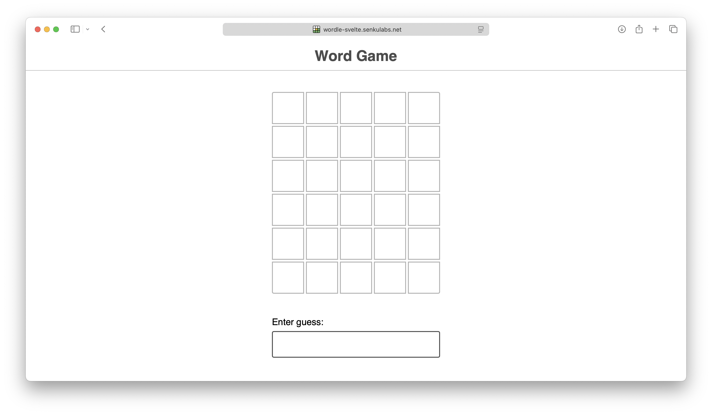
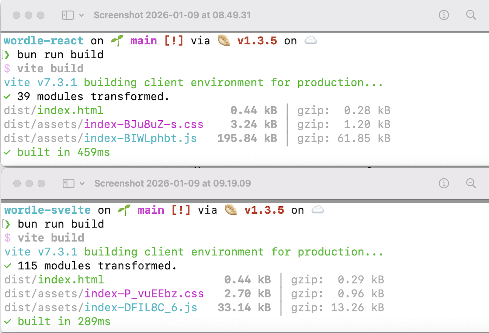
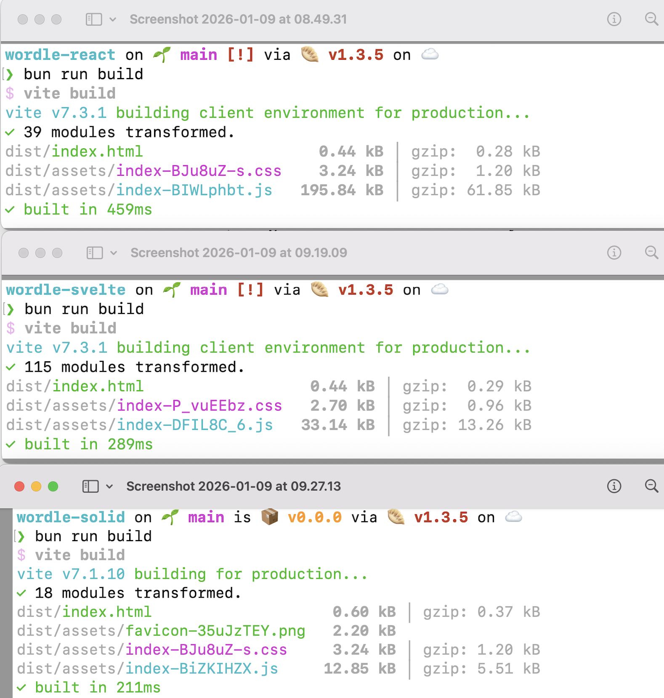
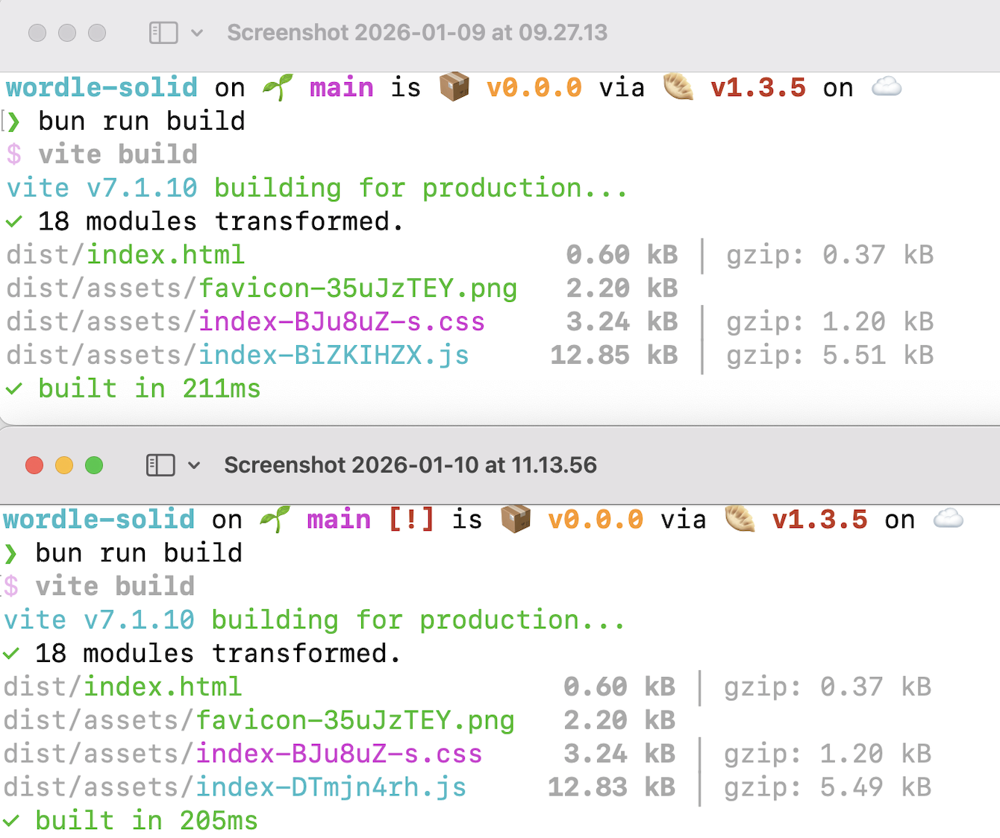

In 2024, I purchased the [Joy of React](https://www.joyofreact.com) course created by [Josh Comeau](https://www.joshwcomeau.com). The reason is my knowledge to understand React is not great and the courses that created by Josh is exceptional. Josh is a great teacher than can turn the boring course into fun course. Thanks to his crystal clear explaination and interactive course. In chapter of Joy of React course, Josh gives the students challenge to [build a Wordle game](https://github.com/joy-of-react/project-wordle). The Wordle game itself released in 2021 created by software engineer Josh Wardle. In short the game gives you 6 tries and you need to figure out the word that contains 5 letters in order to win the game.



In code program, the game itself divided by 3 components: `GuessResults`, `Guess` (inside GuessResults component), and `GuessInput`. The `GuessInput` just a regular `<input type="text" />` NOT a fancy virtual keyboard.

```jsx
// Games.jsx

export default () => {
    return (
        <>
            <GuessResults guesses={guesses} />
            <GuessInput gameStatus={gameStatus} handleGuessInput={handleGuessInput} />
        </>
    )
}
```

There are three props or properties there:

1. The `guesses` prop for collect list of guess,
2. The `gamestatus` prop for indicate the game is `running` or over (`win` or `lose`),
3. The `handleGuessInput` prop (event handler) for received input guess from end-user.

The implementation code program in React use React functional components with hooks and in Svelte use runes. Then, let's see the JavaScript bundle sizes result.

## The JavaScript Bundle Sizes Result

Because both of React and Svelte are JavaScript library for create User Interface, let's focus on the bundle sizes result in JavaScript side. I use MacBook Air M1 base model with Bun version 1.3.5 and Vite version 7.3.1 in 9th January 2026. The project created with Vite scaffolder. For React, it uses `@vitejs/plugin-react-swc` version 4.2.2.

| JS UI Libraries        | React (v19.2.3) | Svelte (v5.46.1) |
|:-----------------------|:----------------|:-----------------|
| JS bundle size (in kB) | 195.84          | 33.14            |
| Time to build (in ms)  | 459             | 289              |

The result is React bundle sizes is near to 6x than Svelte's. Then, time to build in React takes 1.5x than Svelte's.



Now, I would like to give some imagination here. The more lines of code you put in the program then the more times for compiler to compile your code program even you have the sophisticated compiler. This also impact to the time you need to waiting the deployment is finished in real-world while you have a very urgent thing in the real-world. This also impact to the time our software appear in our end-user screen. In order words, the more lines of code you put then you will wasted the time in the real-world. That's it. The key is lied on the JS UI library we used. So, programmers please choose *your poison* wisely.

Alright, than you think Svelte is the winner here, right? Right?


I wish too. Because Svelte is the JavaScript UI library that I'm really like and I love. But, sadly we have another winner here.

## Enter The Black Horse, SolidJS

Yes, you're right. SolidJS is the winner in this post. Let me tell you the reason I choose Solid. Since Svelte 5, Rich Harris introduced `runes` which behind the scene is signal. The **signal** in JavaScript in simple way is an observer that tracks value(s). If value(s) change then only the necessary functions or UI components will be updated instead of whole components. In React, you need to use `useMemo` to tell React that "Hey, update this component only if the values I put in `useMemo` is changed". At least it was my interpretation. Please forgive me if I'm wrong, React folks!

Back to **signal**. Besides Svelte, Vue use it (soon) in Vue Vapor mode, Preact also use it, Angular use it, and many JS UI library use it. The person who's influence this idea is [Ryan Carniato, the creator of SolidJS](https://dev.to/ryansolid). But, if we take a look closer in SolidJS's docs, the **signal** itself introduced since KnockoutJS which use the term of **observer** rather than **signal**.

If you code SolidJS, you feel like you code React but with Signal and no Virtual DOM. That's it. Let's jump to the result of JS bundle sizes in SolidJS in a Wordle game.

| JS UI Libraries        | React (v19.2.3) | Svelte (v5.46.1) | Solid (1.9.9) |
|:-----------------------|:----------------|:-----------------|:--------------|
| JS bundle size (in kB) | 195.84          | 33.14            | 12.85         |
| Time to build (in ms)  | 459             | 289              | 211           |



The result is React bundle sizes is near to 15x than Solid's. Then, time to build in React takes 2x than Solid's.

> I will repeat again my words again below.

Now, I would like to give some imagination here. The more lines of code you put in the program then the more times for compiler to compile your code program even you have the sophisticated compiler. This also impact to the time you need to waiting the deployment is finished in real-world while you have a very urgent thing in the real-world. This also impact to the time our software appear in our end-user screen. In order words, the more lines of code you put then you will wasted the time in the real-world. That's it. The key is lied on the JS UI library we used. So, programmers please choose *your poison* wisely.

## Optimize Code Program in SolidJS

The result I show to you was yesterday result in 9th January 2026. This morning, I take a look again in my code program in `wordle-solid`. I'm really suspicious with this `()` and without `()`.

```tsx
// Game.tsx
export default () => {
    const [gameStatus, setGameStatus] = createSignal<'running' | 'win' | 'lose'>('running');
    const [guesses, setGuesses] = createSignal<({ letter: string, status: string }[] | null)[]>([]);

    return (
        <GuessResults guesses={guesses} />
        <GuessInput gameStatus={gameStatus()} handleGuessInput={handleGuessInput} />
    )
}
```

You see? I pass `guesses` prop into the `GuessResults` component. I pass `gameStatus()` prop into the `GuessInput` component. Now, let's take a look in `GuessResults` and `GuessInput` components.

```tsx
// GuessResults.tsx
import { Accessor, createMemo, For } from 'solid-js';
import { NUM_OF_GUESSES_ALLOWED } from '../constants';
import { range } from '../utils';
import Guess from './Guess';

export default ({ guesses }: { guesses: Accessor<({ letter: string, status: string }[] | null)[]> }) => {
    const guessRows = createMemo(() => {
        return range(NUM_OF_GUESSES_ALLOWED).map(index => guesses()[index])
    });

    return (
        <div class="guess-results">
            <For each={guessRows()}>
                {(guess) => <Guess guess={guess} />}
            </For>
        </div>
    )
}
```

```tsx
// GuessInput.tsx
export default ({ gameStatus, handleGuessInput }: { gameStatus: 'running' | 'win' | 'lose', handleGuessInput: (guess: string) => void }) => {
    const [value, setValue] = createSignal<string>('');

    function handleSubmit(event: SubmitEvent) {
        event.preventDefault();
        handleGuessInput(value());
        setValue('');
    }

    return (
        <form onSubmit={handleSubmit} class="guess-input-wrapper">
            <label for="guess-input">Enter guess:</label>
            <input disabled={gameStatus !== 'running'} required type="text" id="guess-input" minlength={5} maxlength={5} pattern="[a-zA-Z]{5}" title="5 letter word" value={value()} oninput={(event) => setValue(event.target.value.toUpperCase())} />
        </form>
    )
}
```

I'm suspicious into my code proram in two things:

1. Why I pass the `guesses` prop in `GuessResults` component meanwhile I pass the `gameStatus()` prop in the `GuessInput` component? Actually, I just want only passing the props value NOT the whole things like `guesses` prop. For your information, because Solid use **signal** then to get the actual value you need to use `()` there. It's bit tricky because Solid's signal implementation is a `reactive` function. You and I need to take a time adapt with it.

2. Why the implementation of `GuessResults` are complicated? Like I'm using `createMemo`. Which is **WHAT THE HELL!**. I'm just want to consume the props and display it as read-only props. That's it.

Then, after I read the Solid's documentation, I make a mistake: **Props** should not be spreaded or [destructring props is not allowed because it can break the reactivity](https://docs.solidjs.com/concepts/components/props#destructuring-props). When receive props in Solid's component, you just need to use word `props` like this:

```tsx
// GuessResults.tsx
import { For } from 'solid-js';
import { NUM_OF_GUESSES_ALLOWED } from '../constants';
import { range } from '../utils';
import Guess from './Guess';

interface GuessResultsProps {
    guesses: ({ letter: string, status: string }[] | null)[]
}

export default (props: GuessResultsProps) => {

    return (
        <div class="guess-results">
            <For each={range(NUM_OF_GUESSES_ALLOWED).map(index => props.guesses[index])}>
                {(guess) => <Guess guess={guess} />}
            </For>
        </div>
    )
}
```

```tsx
// GuessInput.tsx

import { createSignal } from 'solid-js'

interface GuessInputProps {
    gameStatus: 'running' | 'win' | 'lose',
    handleGuessInput: (guess: string) => void
}

export default (props: GuessInputProps) => {
    const [value, setValue] = createSignal<string>('');
    
    function handleSubmit(event: SubmitEvent) {
        event.preventDefault();
        props.handleGuessInput(value());
        setValue('');
    }

    return (
        <form onSubmit={handleSubmit} class="guess-input-wrapper">
            <label for="guess-input">Enter guess:</label>
            <input disabled={props.gameStatus !== 'running'} required type="text" id="guess-input" minlength={5} maxlength={5} pattern="[a-zA-Z]{5}" title="5 letter word" value={value()} oninput={(event) => setValue(event.target.value.toUpperCase())} />
        </form>
    )
}
```

Now, in the `Game` component, the passing props into `GuessResults` and `GuessInput` now consistent using `()`.

```tsx
export default () => {
    const [gameStatus, setGameStatus] = createSignal<'running' | 'win' | 'lose'>('running');
    const [guesses, setGuesses] = createSignal<({ letter: string, status: string }[] | null)[]>([]);

    return (
        <GuessResults guesses={guesses()} />
        <GuessInput gameStatus={gameStatus()} handleGuessInput={handleGuessInput} />
    )
}
```

I rebuild again, I'm saving 0.02 kB and 6 milliseconds.

| JS UI Libraries        | Solid (1.9.9) | Solid (1.9.9) Optimized |
|:-----------------------|:--------------|:------------------------|
| JS bundle size (in kB) | 12.85         | 12.83                   |
| Time to build (in ms)  | 211           | 205                     |



Well, this is just a tiny improvement in small components. Imagine if you work in project that has many features and a lot of components. The fundamental of how to use the thing is still required by human as verifier and optimizer when the [code program this day is generated by AI](./ai-still-needs-you).

## Source Code

1. [senkulabs/wordle-react](https://github.com/senkulabs/wordle-react).
2. [senkulabs/wordle-svelte](https://github.com/senkulabs/wordle-svelte).
3. [senkulabs/wordle-solid](https://github.com/senkulabs/wordle-solid).